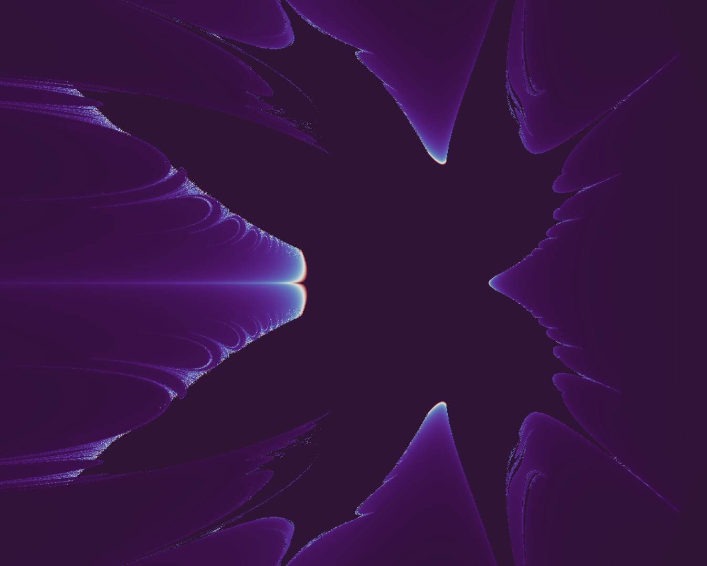
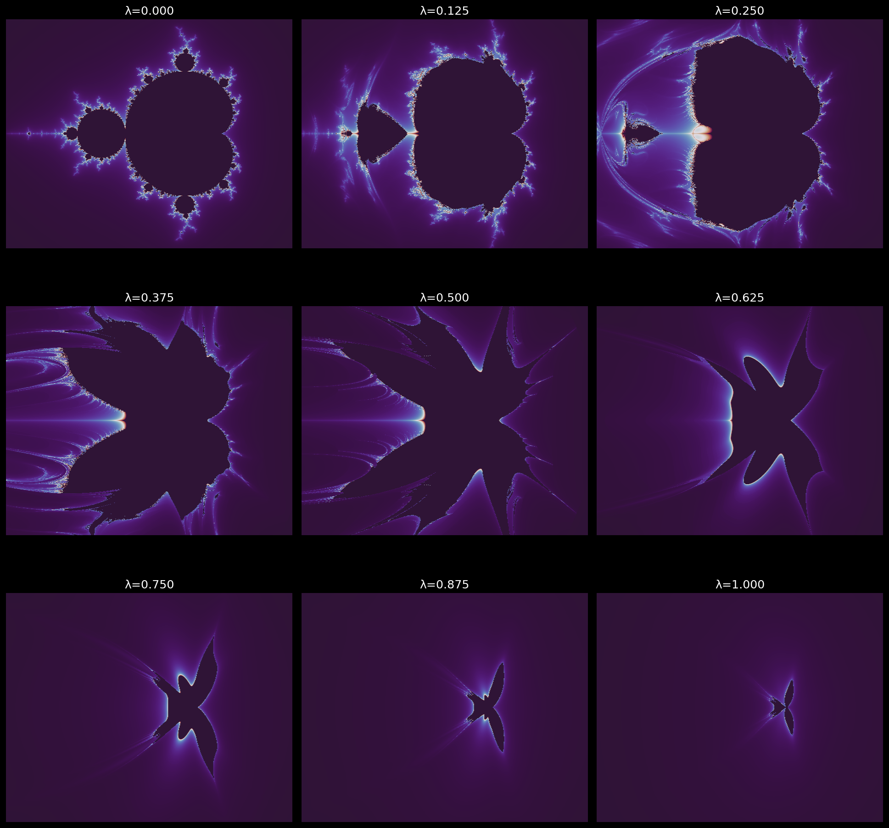
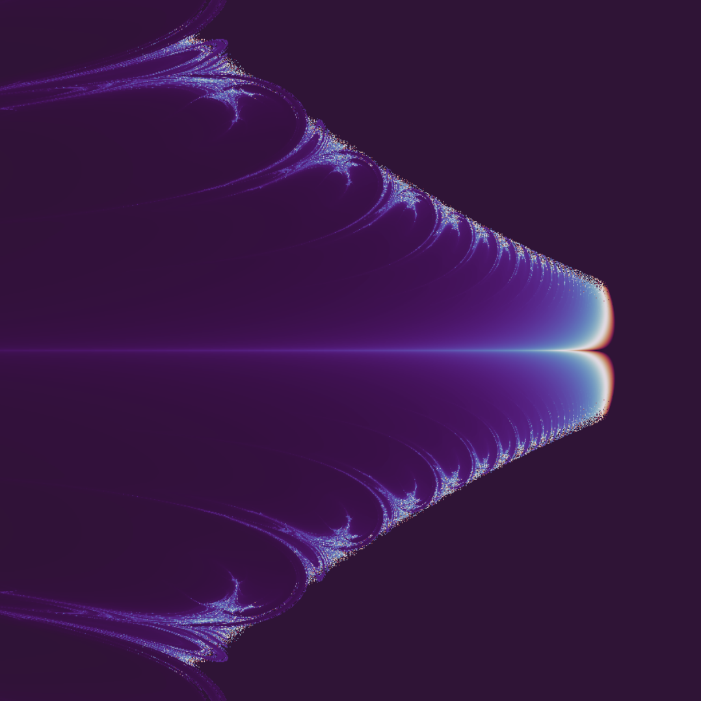

# 🌊 The Moiré-Mandelbrot

Test it at huggingface live: 

https://huggingface.co/spaces/Aluode/MoireMandelbrot

**A continuous family of fractals that interpolates between the classical
Mandelbrot set and a dynamical system whose update rule is Fubini-Study /
Moiré attention.**



Drag one parameter **λ** from 0 to 1 and you smoothly deform the
Mandelbrot set into a three-lobed "Moiré fractal", passing through a
**petaled, filigreed, liquid regime** around λ ≈ 0.5.

Both endpoints of the morph live on the same stage — the Riemann sphere
CP¹ with the Fubini-Study metric. The deformation is continuous because
it is geometrically natural, not because we forced it.

## What this is

Two well-known things are secretly the same object seen from different
angles:

1. The Mandelbrot iteration **z → z² + c** is a degree-2 rational map on
   the Riemann sphere CP¹.

2. "Moiré attention" / phase-coherence attention uses the scoring
   function **Re ⟨q, k⟩_H = Σ_j A_q(j) A_k(j) cos(φ_q(j) − φ_k(j))**,
   which is the real part of the canonical Hermitian inner product on
   CP^(d−1). This pairing is the Fubini-Study metric's natural
   measurement.

Same manifold. Different dynamics. What happens if you **linearly
interpolate** between them?

The answer is this repo: a new family of fractals. At λ = 0 you get the
familiar Mandelbrot set. At λ = 1 you get a small three-lobed shape
whose lobes correspond to the three attention keys used in the
construction. In between — fractals no one has rendered before, as far
as I can tell.

## The morph



Row 1: **λ = 0.00, 0.125, 0.25** — Mandelbrot bulges, filaments thicken.
Row 2: **λ = 0.375, 0.50, 0.625** — the liquid regime. The cardioid
splits into six petals with fractal filigree along the edges.
Row 3: **λ = 0.75, 0.875, 1.00** — the petals fold inward. The object
condenses into a small bird/butterfly and finally into the pure three-lobed
Moiré fractal.

Zoomed into the left-edge scaling around λ=0.4:



## The math

For each point *c* in the complex plane, iterate from z = 0:

```
Mandelbrot step:  M(z, c) = z² + c

Moiré step:       keys K = {1, c, c·c̄}
                  score_k = Re<z, k>_H / (|z| |k|)         # FS chordal
                  weights w = softmax(score / T)
                  direction d = Σ_k w_k · k_k
                  r = |z|² + |d|
                  φ = 2·arg(d) + arg(c)
                  FS(z, c) = r · exp(i·φ) + c

Mixed step:       U(z, c; λ) = (1 − λ) M(z, c) + λ FS(z, c)
```

Color *c* by how fast the orbit escapes. The bounded region is the
fractal.

**Why three keys?** The simplest non-trivial attention event needs at
least three references so the softmax has non-degenerate weights at
every *c*. The choices {1, c, c·c̄} are the three canonical building
blocks — constant, linear, quadratic-amplitude — and together they
already produce rich behavior. The three-lobed signature of the pure
Moiré fractal (λ=1) reflects this choice: each lobe is an attention
basin.

**Why the phase doubling?** In the pure Mandelbrot step `z → z²`, the
argument doubles: `arg(z²) = 2·arg(z)`. The phase-doubling `2·arg(d)`
in the Moiré step is the direct analogue: attention picks a direction
`d`, and we double its argument so magnitude expansion and angular
rotation both have the flavor of the degree-2 map. Without this, the
Moiré step is a convex combination of keys (bounded, no fractal).

**Temperature T.** Controls how sharp the attention is. Low T → nearly
one-hot (the fractal has more corners and cusps). High T → nearly
uniform (the fractal becomes a smooth blob). The demo defaults to
T = 0.5.

## Why this exists

This fell out of a longer investigation into the *Fubini-Study
substrate* hypothesis — the observation that Moiré attention, wave
memory retrieval, and cross-band neural coherence all compute the same
geometric object (the FS Hermitian pairing on CP¹). See the [original
paper](the_fubini_study_substrate.md) for context.

One honest question kept being asked in that work: "okay, if this is
really the natural geometry, show me a picture no one has seen before."
That is this repo. The Mandelbrot set and phase-coherence attention are
two dynamical systems on the same Kähler manifold; you can literally
interpolate between them; and the interpolation is beautiful.

It doesn't prove the physics, but it does make the geometric family
visible.

## Usage

### As a Gradio app

```bash
pip install -r requirements.txt
python app.py
```

Drag the sliders. Everything renders in NumPy on CPU; at 500×500 each
frame takes ~1 second on a modest machine.

### As a library

```python
from moire_mandelbrot import render

# Returns a 2D numpy array of smooth escape-times.
# Pair with any matplotlib colormap to color.
et = render(lam=0.5, resolution=600, iters=80)
```

### Regenerate the gallery

```bash
python make_gallery.py
```

## File map

| File | What it is |
|---|---|
| `moire_mandelbrot.py` | Core dynamics + renderer (pure NumPy). |
| `app.py` | Gradio app, suitable for Hugging Face Spaces. |
| `make_gallery.py` | Regenerates the images in `gallery/`. |
| `requirements.txt` | Minimal deps: numpy, matplotlib, gradio, pillow. |
| `gallery/` | Pre-rendered images used in this README. |

## What this is not

- **Not a new theorem.** The Mandelbrot set and Fubini-Study attention
  both living on CP¹ is an observation, not a proof of anything about
  either one.
- **Not a fast fractal renderer.** Pure NumPy on CPU, tuned for clarity
  over speed.
- **Not a replacement for Mandelbrot.** The classical fractal remains
  mathematically richer; this is a sibling, not a successor.

## Credit and provenance

Built by Claude (Anthropic) from a one-liner prompt by
[Antti Luode](https://github.com/anttiluode) — "make a liquid funky
Mandelbrot" — on top of the identification Antti and I had been
working on that Moiré attention ≡ Re⟨·,·⟩_H on CP^(d−1).

The fractal family shown here is, as far as I know, new. If anyone has
rendered it before, please open an issue with a pointer.

## License

MIT.
